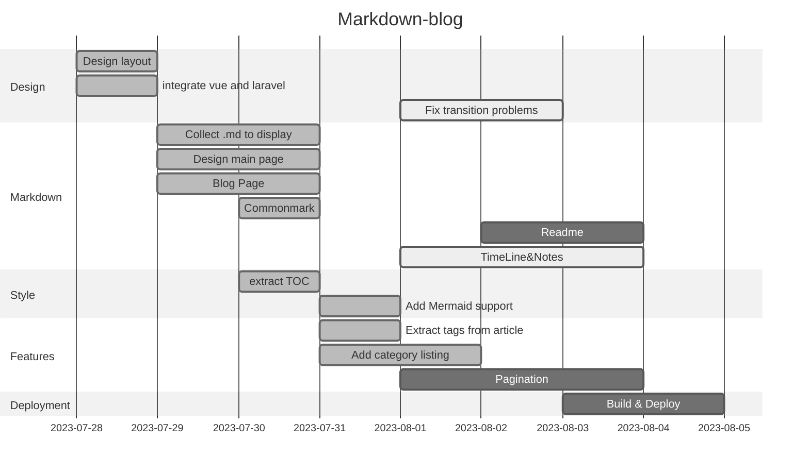

# Markdown driven Blog

## Description
This is a personal blog, using [Inertia](https://inertiajs.com) over [Laravel](https://laravel.com) with [Vue](https://vuejs.org) for the frontend and [Mermaid](https://mermaid-js.github.io/mermaid/#/) as a diagraming tool.

Main inspiration from this [article by *Stef*](https://codingwithstef.com/2021-01-17-creating-a-markdown-driven-blog-using-laravel-8).

It is file-driven, so you can use [Markdown](https://en.wikipedia.org/wiki/Markdown) to write your blog posts. without resorting to a database.

It is part of a series of projects, that I am working on, using Vue, Laravel, Php, Inertia, Livewire, Alpinejs and Nuxt.

## Usage
- Blog posts should be placed in the ```resources/views/articles``` folder. Inside a year folder.
    The filesystem will scan for markdown files.
- Notes should be placed in the ```resources/views/notes``` folder. The filesystem will scan for markdown files.
- Images should be placed in the ```public/images``` folder. and can be referenced from the markdown files.

## Acknowledgment
- [Torchlight](https://torchlight.dev/) for the syntax highlight
- [Mermaid](https://mermaid-js.github.io/mermaid/) for diagraming

## Timeline

